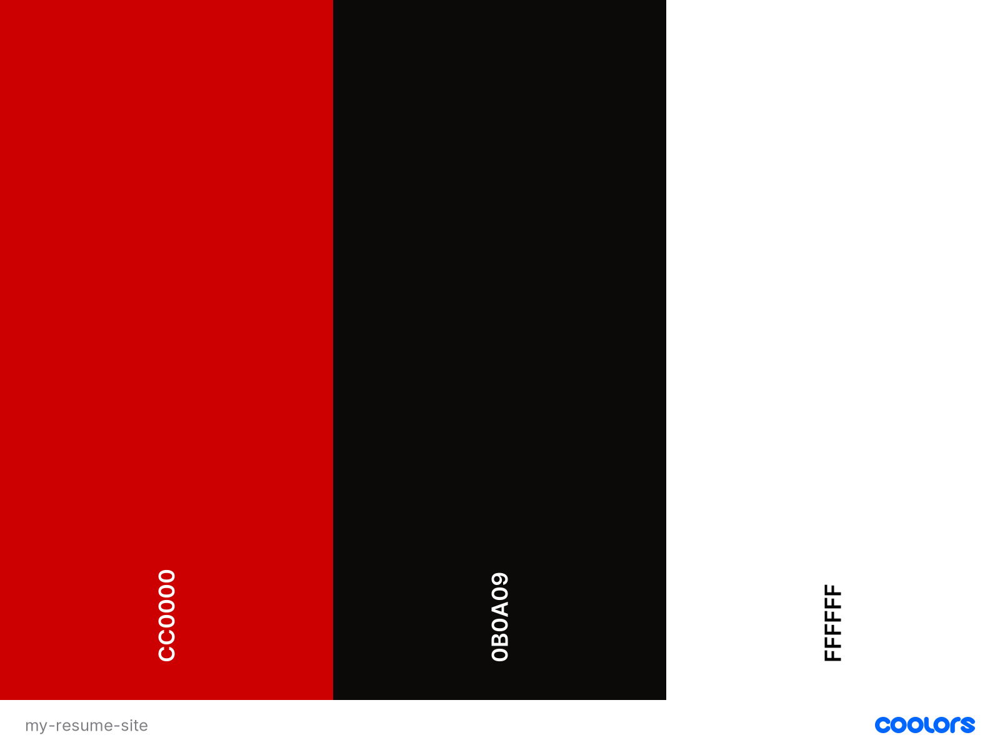

# Guled Mahamoud Resume

## Contents 
---
  * [UX (User Experience)](#ux--user-experience-)
    + [Project Goals](#project-goals)
    + [User Goals](#user-goals)
    + [User Stories](#user-stories)
    + [Site Owner Goals](#site-owner-goals)
    + [User Requirements and Expectations](#user-requirements-and-expectations)
    + [Design Choices](#design-choices)
    + [Wireframing](#wireframing)
  * [Technologies Used](#technologies-used)
  * [Features](#features)
  * [Testing](#testing)
  * [Bugs](#bugs)
  * [Deployment](#deployment)
  * [References](#references)
    + [Code References](#code-references)
    + [Image Sources](#image-sources)
    + [Special Thanks](#special-thanks)

## UX (User Experience) 

### Project Goals
The **goal** for this project is to display professional experience, skills and personal qualities to **potential** employers or anyone interested in learning about me.

### User Goals 
* To have a look at site owner's technical skills, education and professional experience.
* To be able to contact site owner for more information and to express interest.
* Have a look at site owner's portfolio of projects.

### User Stories 
* To be able to contact site owner to express interest and to make enquiries.
* To **easily** be able have check out site owner's porfolio of projects: look at the deployed projects and source code on Github.
* to be able to **easily** find site owner's information about their professional experience, education and skills.

## Site Owner Goals 
* To be able to make it as **easy** as possible for potential employers to get in contact for enquiries and to express interest.
* To be able to make it as **easy** as possible for potential employers to find information about my professional exprience, skills and education.
* To be able to log into the site in order to create, display, update and delete information. 

### User Requirements and Expectations 

**Requirements**
* **Navigate** the website using the navbar that sends user to the requested page.
* A **contact form** that allows user to input **contact details and enquiries**.

**Colours**

I used the [Coolors](https://coolors.co/) colour generator 
to find the colour scheme that suited best for the project. 

### Wireframing 

For **wireframing**, I used [Balsamiq](https://balsamiq.com/). I used it to create **simple** wireframes 
showing the basic structure on which I built the website on. Some features maybe removed or added during 
development. 

View wireframes for each device here:
* [Desktop](wireframes/Desktop.png)
* [Tablet](wireframes/Mobile.png)
* [Mobile](wireframes/Tablet.png)

## Technologies Used 
---
**Languages**

* [HTML](https://developer.mozilla.org/en-US/docs/Web/HTML)
* [CSS](https://developer.mozilla.org/en-US/docs/Web/CSS)
* [JavaScript](https://en.wikipedia.org/wiki/JavaScript)
* [Python](https://www.python.org/)

**Tools & Libraries**

* [Bootstrap](https://getbootstrap.com/)
* [Google Fonts](https://fonts.google.com/)
* [Gitpod](https://gitpod.io/workspaces/)
* [JQuery](https://jquery.com/)
* [Flask](https://flask.palletsprojects.com/en/2.0.x/)

## Features 
---
**Features** that have been **implemented**:

**Features** that will be **implemented** in the **future**: